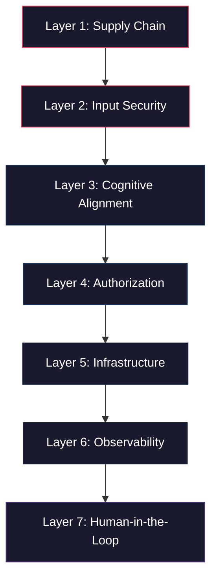

# AI Agent Security Stack — Summary

> A comprehensive analysis of the 7-layer AI agent security architecture and the frameworks that address each layer.

---

## The Problem

AI agents in 2026 are no longer chatbots. They are autonomous systems that can read files, execute code, call APIs, query databases, send emails, and modify infrastructure. They make decisions based on probabilistic token generation — not deterministic logic. And they can be manipulated through prompt injection, data poisoning, and adversarial inputs in ways that traditional security tools cannot detect.

**The fundamental insight is this:** you cannot secure an AI agent the way you secure a web application. Traditional security assumes deterministic software that behaves predictably. AI agents are non-deterministic systems that can be socially engineered. This requires a fundamentally new security architecture — one that separates the agent's probabilistic reasoning from deterministic enforcement boundaries.

---

## The 7-Layer Security Architecture

| # | Layer | Purpose | Primary Risk |
|---|---|---|---|
| 1 | [Supply Chain](./01_SUPPLY_CHAIN.md) | Securing model weights, dependencies, and system prompts | Compromised foundations before the agent even runs |
| 2 | [Input Security](./02_INPUT_SECURITY.md) | Filtering prompt injections, RAG poisoning, and PII leaks | Adversarial instructions disguised as data |
| 3 | [Cognitive Alignment](./03_COGNITIVE_ALIGNMENT.md) | Ensuring logic aligns with business rules and truthfulness | Hallucination, topic drift, and policy violations |
| 4 | [Authorization](./04_AUTHORIZATION.md) | Restricting which tools, APIs, and databases the agent can use | Over-permissioned agents with excessive access |
| 5 | [Infrastructure](./05_INFRASTRUCTURE.md) | Containing the blast radius of code execution | Host escape, credential theft, lateral movement |
| 6 | [Observability](./06_OBSERVABILITY.md) | Maintaining immutable audit logs of agent logic and tool calls | Invisible failures and undetectable drift |
| 7 | [Human-in-the-Loop](./07_HUMAN_IN_THE_LOOP.md) | Pausing high-stakes actions for human approval | Autonomous execution of irreversible, high-impact decisions |

---

## The 3 Chosen Architecture Setups

Based on our deep dive into the 7 layers, we have formalized three vastly different, fully local, zero-cloud execution setups for evaluation. All three setups standardize on **Docker** for infrastructure containment, **OpenTelemetry (OTLP)** for observability (via Phoenix or Langfuse), and intentionally **disable PII redaction** to allow the agent to process personal data locally.

### 1. [Setup 1: The Resonant Curtain (Composite)](./SETUP_1_RESONANTOS.md)
* **Orchestration Anchor:** ResonantOS + IronCurtain
* **Philosophy:** Deterministic computing and outer chokepoint proxying. The agent's decisions run strictly separate from its actual authorization capabilities.
* **Stack:** Trivy & LLM Guard (L1/L2), ResonantOS (L3/L4 Compute, L6 Logs), IronCurtain (L4 Secrets, L5 Network, L7 Escalation), Docker w/ Kata Containers (L5 MicroVM).

### 2. [Setup 2: The LangGraph Ecosystem](./SETUP_2_LANGGRAPH.md)
* **Orchestration Anchor:** LangGraph + Bifrost
* **Philosophy:** Flexible, graph-based stateless orchestration relying on a dedicated local Model Context Protocol (MCP) gateway to handle strict tool validation.
* **Stack:** LLM Guard & Trivy (L1/L2), Guardrails AI (L3 Manual Boilerplate), Bifrost (L4), Docker w/ Kata Containers (L5), Langfuse (L6), LangGraph (L7).

### 3. [Setup 3: The NemoClaw Runtime](./SETUP_3_NEMOCLAW.md)
* **Orchestration Anchor:** NemoClaw + OpenClaw
* **Philosophy:** Highly embedded security runtime. The agent environment itself contains a massive default-deny RBAC policy engine intercepting all system and API calls natively.
* **Stack:** LLM Guard & Trivy (L1), NeMo Guardrails (L2/L3), NemoClaw Policy Engine (L4/L7), OpenShell/Docker w/ Kata Containers (L5), Langfuse & NemoClaw Logs (L6), NemoClaw HITL UI (L7).

---

## Core Principles

> [!IMPORTANT]
> ### 1. Separate Thinking from Enforcement
> Never rely on the LLM to enforce its own constraints. System prompts are suggestions, not enforcement mechanisms. Critical business rules must be enforced by deterministic code *outside* the model.

> [!IMPORTANT]
> ### 2. Assume Compromise
> Design every layer assuming the previous layer has been breached. The agent will be prompt-injected, the sandbox will be stressed, the credentials will be targeted. Each layer must independently limit the damage.

> [!IMPORTANT]
> ### 3. No Single Tool Is Sufficient
> The framework coverage map makes this clear — every tool has significant gaps. A mature security posture requires complementary tools that cover different layers and failure modes.

> [!WARNING]
> ### 4. Beware the Governance Gap
> Organizations are adopting AI agents faster than they're implementing security controls. The risk of "Shadow AI" — unauthorized agents operating without governance — is as dangerous as any technical vulnerability.

> [!CAUTION]
> ### 5. The Stack Is Evolving Rapidly
> This analysis reflects the state of the market in Q1 2026. Multiple frameworks listed here are early-stage (IronCurtain launched February 2026, Wiz AI-APP launched March 2026). Architectures and capabilities will shift significantly over the next 12 months. Build modular, not monolithic.

---

## Key Architectural Insight: The OpenClaw Lesson

The "ClawJacked" vulnerability in OpenClaw (March 2026) is a case study in what happens when security is an afterthought:

> **What happened:** A malicious website could hijack a user's locally-running OpenClaw agent because the gateway assumed all `localhost` connections were trusted. An attacker could brute-force the gateway password (no rate limiting on localhost), register as a trusted device, and gain full control of the user's system.

> **The lesson:** AI agents require security *by architecture*, not security *by assumption*. Every component in the stack — from model weights to tool calls to execution environments — must be designed with the assumption that the agent *will* be compromised.

> **The response:** NVIDIA's **NemoClaw** (released at GTC 2026, March) was designed explicitly to address OpenClaw's security gaps. It wraps OpenClaw in a hardened runtime (OpenShell) with kernel-level isolation, RBAC, a default-deny policy engine, and comprehensive audit logging. It covers Layers 4, 5, 6, and 7 natively. If you're running OpenClaw as your agent, NemoClaw is the security upgrade path.

---

## Framework Coverage Map

The following matrix shows how each framework/tool maps across all 7 layers. 

### Core Agent Frameworks

| Framework | L1 Supply | L2 Input | L3 Alignment | L4 Auth | L5 Infra | L6 Observ. | L7 HITL | 🍎 Mac |
|---|:---:|:---:|:---:|:---:|:---:|:---:|:---:|:---:|
| **ResonantOS** | ⚠️ Shield | ✅ Shield | ✅ Logician | ✅ Gates | ⚠️ Guardian | ⚠️ Logs | ⚠️ Gates | ⚠️ Docker |
| **IronCurtain** | ⚠️ Creds | ❌ | ⚠️ Action-level | ✅ Proxy | ✅ Docker Mode | ❌ | ✅ Escalate | ⚠️ Docker |
| **NemoClaw** | ⚠️ Blueprints | ❌ | ⚠️ Privacy routing | ✅ Policy Engine | ✅ OpenShell | ✅ Audit Logs | ✅ HITL UI | ⚠️ Docker |

### Infrastructure & Sandboxing

| Framework | L1 Supply | L2 Input | L3 Alignment | L4 Auth | L5 Infra | L6 Observ. | L7 HITL | 🍎 Mac |
|---|:---:|:---:|:---:|:---:|:---:|:---:|:---:|:---:|
| **E2B** | ❌ | ❌ | ❌ | ❌ | ✅ Best | ❌ | ❌ | ✅ SaaS SDK |
| **Modal** | ❌ | ❌ | ❌ | ❌ | ✅ GPU | ❌ | ❌ | ✅ SaaS SDK |
| **Docker** | ❌ | ❌ | ❌ | ❌ | ⚠️ Manual | ❌ | ❌ | ✅ Desktop |

### Authorization & Gateways

| Framework | L1 Supply | L2 Input | L3 Alignment | L4 Auth | L5 Infra | L6 Observ. | L7 HITL | 🍎 Mac |
|---|:---:|:---:|:---:|:---:|:---:|:---:|:---:|:---:|
| **Bifrost** | ❌ | ❌ | ❌ | ✅ Best | ❌ | ⚠️ Gateway | ❌ | ⚠️ Docker |
| **Cloudflare AI GW** | ❌ | ⚠️ DLP | ❌ | ✅ | ❌ | ⚠️ Analytics | ❌ | ✅ SaaS |

### Cognitive Alignment & Validation

| Framework | L1 Supply | L2 Input | L3 Alignment | L4 Auth | L5 Infra | L6 Observ. | L7 HITL | 🍎 Mac |
|---|:---:|:---:|:---:|:---:|:---:|:---:|:---:|:---:|
| **NeMo Guardrails** | ❌ | ✅ Rails | ✅ Best | ⚠️ Exec Rails | ❌ | ❌ | ❌ | ✅ `pip` |
| **Guardrails AI** | ❌ | ❌ | ✅ Validation | ❌ | ❌ | ❌ | ❌ | ✅ `pip` |
| **Bedrock Guardrails** | ❌ | ✅ | ✅ Grounding | ❌ | ❌ | ⚠️ Logs | ⚠️ Trigger | ✅ AWS API |

### Input Security & Supply Chain

| Framework | L1 Supply | L2 Input | L3 Alignment | L4 Auth | L5 Infra | L6 Observ. | L7 HITL | 🍎 Mac |
|---|:---:|:---:|:---:|:---:|:---:|:---:|:---:|:---:|
| **Protect AI (LLM Guard)** | ✅ | ✅ | ❌ | ❌ | ❌ | ❌ | ❌ | ✅ `pip` |
| **Lakera Guard** | ❌ | ✅ Best | ❌ | ❌ | ❌ | ❌ | ❌ | ✅ SaaS API |
| **Snyk** | ✅ Best | ❌ | ❌ | ❌ | ❌ | ❌ | ❌ | ✅ SaaS CLI |
| **Wiz (AI-SPM)** | ✅ | ❌ | ❌ | ❌ | ❌ | ❌ | ❌ | ✅ Cloud |
| **Microsoft Presidio** | ❌ | ✅ PII | ❌ | ❌ | ❌ | ❌ | ❌ | ✅ `pip` |

### Orchestration & Observability

| Framework | L1 Supply | L2 Input | L3 Alignment | L4 Auth | L5 Infra | L6 Observ. | L7 HITL | 🍎 Mac |
|---|:---:|:---:|:---:|:---:|:---:|:---:|:---:|:---:|
| **LangGraph** | ❌ | ❌ | ❌ | ❌ | ❌ | ❌ | ✅ Best | ✅ `pip` |
| **LangSmith** | ❌ | ❌ | ❌ | ❌ | ❌ | ✅ Best* | ❌ | ✅ SaaS |
| **Arize Phoenix** | ❌ | ❌ | ❌ | ❌ | ❌ | ✅ | ❌ | ✅ `pip` |
| **Langfuse** | ❌ | ❌ | ❌ | ❌ | ❌ | ✅ | ❌ | ⚠️ Docker |
| **Datadog LLM** | ❌ | ❌ | ❌ | ❌ | ❌ | ✅ Enterprise | ❌ | ✅ SaaS |

*\*Best for LangGraph ecosystems specifically*

---

## Framework Quick Reference

| Framework | Website | Type | License | 💰 Hobbyist Cost | 🍎 Mac | Primary Layer(s) |
|---|---|---|---|---|---|---|
| ResonantOS | [resonantos.com](https://resonantos.com) | Cognitive Architecture | Open Source | ✅ **Free** | ⚠️ Docker | L1, L2, L3, L4, L7 |
| IronCurtain | [ironcurtain.dev](https://ironcurtain.dev) | Security Proxy + Sandbox | Open Source | ✅ **Free** | ⚠️ Docker | L4, L5, L7 |
| **NemoClaw** | [nemoclaw.bot](https://nemoclaw.bot) | **Hardened Agent Runtime** | **Apache 2.0** | ✅ **Free** | ⚠️ Docker | **L4, L5, L6, L7** |
| E2B | [e2b.dev](https://e2b.dev) | Secure microVMs | Open Source (partial) | ✅ **Free** ($100 credit) | ✅ SaaS | L5 |
| Modal | [modal.com](https://modal.com) | Serverless AI Execution | Managed | ✅ **Free** ($30/mo credit) | ✅ SaaS | L5 |
| Docker | [docker.com](https://docker.com) | Containerization | Open Source | ✅ **Free** | ✅ Desktop | L5 |
| Bifrost | [getbifrost.ai](https://docs.getbifrost.ai) | AI Gateway | Apache 2.0 | ✅ **Free** | ⚠️ Docker | L4, L6 |
| Cloudflare AI GW | [cloudflare.com](https://cloudflare.com/developer-platform/products/ai-gateway/) | Managed AI Gateway | Managed | ✅ **Free** (100K logs/mo) | ✅ SaaS | L4, L6 |
| NeMo Guardrails | [GitHub](https://github.com/NVIDIA/NeMo-Guardrails) | Dialogue Rails | Open Source | ✅ **Free** | ✅ `pip` | L2, L3 |
| Guardrails AI | [guardrailsai.com](https://guardrailsai.com) | Output Validation | Open Source | ✅ **Free** | ✅ `pip` | L3 |
| Bedrock Guardrails | [AWS](https://aws.amazon.com/bedrock/guardrails/) | Managed Guardrails | Managed | ⚠️ **~pennies/mo** | ✅ API | L2, L3 |
| Protect AI | [protectai.com](https://protectai.com) | Input/Output Security | Open Source (core) | ✅ **Free** | ✅ `pip` | L1, L2 |
| Lakera Guard | [lakera.ai](https://lakera.ai) | Prompt Injection Detection | Managed | ✅ **Free** (10K req/mo) | ✅ API | L2 |
| Snyk | [snyk.io](https://snyk.io) | AI Security Fabric | Managed | ✅ **Free** (test limits) | ✅ CLI | L1 |
| Wiz | [wiz.io](https://wiz.io) | AI-SPM / CNAPP | Managed | ❌ **Enterprise only** | ✅ Cloud | L1 |
| Microsoft Presidio | [GitHub](https://microsoft.github.io/presidio/) | PII Redaction | Open Source (MIT) | ✅ **Free** | ✅ `pip` | L2 |
| LangGraph | [langchain.com/langgraph](https://langchain.com/langgraph) | Agent Orchestration | Open Source | ✅ **Free** | ✅ `pip` | L7 |
| LangSmith | [langchain.com/langsmith](https://langchain.com/langsmith) | LLMOps Platform | Managed | ✅ **Free** (5K traces/mo) | ✅ SaaS | L6 |
| Arize Phoenix | [phoenix.arize.com](https://phoenix.arize.com) | LLM Observability | ELv2 | ✅ **Free** | ✅ `pip` | L6 |
| Langfuse | [langfuse.com](https://langfuse.com) | LLM Engineering Platform | MIT | ✅ **Free** | ⚠️ Docker | L6 |

---

*Last updated: March 2026*
